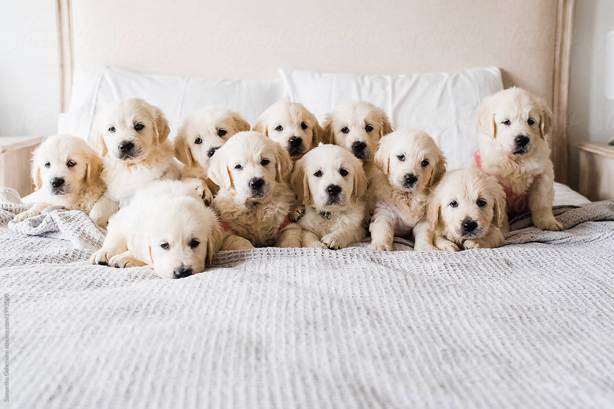

# googleCloudVisionR
[](https://travis-ci.org/emartech/googleCloudVisionR)
[](https://codecov.io/gh/emartech/googleCloudVisionR?branch=master)

R Package for Image Recognition, Object Detection, and OCR using the Google's Cloud Vision API.

## Google Cloud V
ision API

> **Cloud Vision API** enables developers to understand the content of an image by encapsulating powerful machine learning models in an easy-to-use REST API. It quickly classifies images into thousands of categories (such as, “sailboat”), detects individual objects and faces within images, and reads printed words contained within images. You can build metadata on your image catalog, moderate offensive content, or enable new marketing scenarios through image sentiment analysis.

Read more on the [capabilities of the Google Cloud Vision API](https://cloud.google.com/vision/).

## About this R package

This package allows you to call the following functionalities: label, text, landmark, face and logo detection.

The project is a continuation of the [RoogleVision](https://github.com/cloudyr/RoogleVision) package
by Florian Teschner and is relying on the authentication procedures offered by
[googleAuthR](https://cran.r-project.org/web/packages/googleAuthR/index.html).

**WARNING**: the project is in active development and is not guaranteed to be stable in terms of
function names, signatures, etc. Contributions through issues, pull requests are more than
welcome.


## Installation

The package is not yet on CRAN. You can install the package directly from Github:
``` r
devtools::install_github("emartech/googleCloudVisionR")
```

## Authentication

You should use a `.json` file pertaining to a service account for authentication
whose path you should specify in an environment variable `GCV_AUTH_FILE`
for auto-authentication:

```r
Sys.setenv("GCV_AUTH_FILE" = "/fullpath/to/auth.json")
```

This can alternatively be set on the command line or via an `Renviron.site` or
`.Renviron` file (see [here](https://cran.r-project.org/web/packages/httr/vignettes/api-packages.html) for instructions).

If this is set, upon loading the package authentication happens
automatically.

```r
# GCV_AUTH_FILE set so auto-authentication happens
library(googleCloudVisionR)
#> Successfully authenticated via /fullpath/to/auth.json
```

## Example

Let us retrieve annotations for this image:


Label detection (default), with maximum 7 results returned per image:

```r
imagePath <- system.file(
    "extdata", "golden_retriever_puppies.jpg", package = "googleCloudVisionR"
  )
gcv_get_image_annotations(
    imagePaths = imagePath,
    feature = "LABEL_DETECTION",
    maxNumResults = 7
)

#>                      image_path       mid      description     score topicality
#> 1: golden_retriever_puppies.jpg /m/0bt9lr              Dog 0.9953705  0.9953705
#> 2: golden_retriever_puppies.jpg  /m/04rky           Mammal 0.9890478  0.9890478
#> 3: golden_retriever_puppies.jpg  /m/09686       Vertebrate 0.9851104  0.9851104
#> 4: golden_retriever_puppies.jpg  /m/01z5f          Canidae 0.9813780  0.9813780
#> 5: golden_retriever_puppies.jpg  /m/0kpmf        Dog breed 0.9683250  0.9683250
#> 6: golden_retriever_puppies.jpg /m/0d7s3w            Puppy 0.9400384  0.9400384
#> 7: golden_retriever_puppies.jpg /m/01t032 Golden retriever 0.8966703  0.8966703

```

Annotation can also happen in batches, allowing for continuing previously
stopped (or interrupted) annotations as well.

```r
gcv_get_image_annotations(
    imagePaths = c(image_path_1, image_path_2,..., image_path_128),
    batchSize = 64L,
    savePath = "path/to/annotation_file.csv"
)
```
Here we take 128 images and annotate them in batces of size 64.
If, for example, we have previously annotated the first batch of images
whose results have been stored in `savePath`, then only the leftovers
are annotated. A dataframe with all annotations is returned and the
new set of annotations gets appended to `savePath`.

Images can not only be read from local disk, but you can use URLs or Google Cloud Storage URIs as well:
```r
gcv_get_image_annotations(c(
    "https://bit.ly/2IhUzdE",
    "gs://vision-api-handwriting-ocr-bucket/handwriting_image.png"
), maxNumResults = 2)

#>                                                      image_path        mid description     score topicality
#> 1:                                       https://bit.ly/2IhUzdE  /m/0bt9lr         Dog 0.9953705  0.9953705
#> 2:                                       https://bit.ly/2IhUzdE   /m/04rky      Mammal 0.9890478  0.9890478
#> 3: gs://vision-api-handwriting-ocr-bucket/handwriting_image.png /m/07s6nbt        Text 0.9540842  0.9540842
#> 4: gs://vision-api-handwriting-ocr-bucket/handwriting_image.png  /m/03scnj        Line 0.9027576  0.9027576
```
